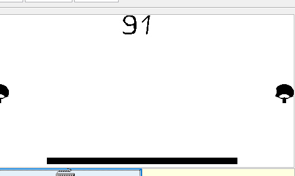
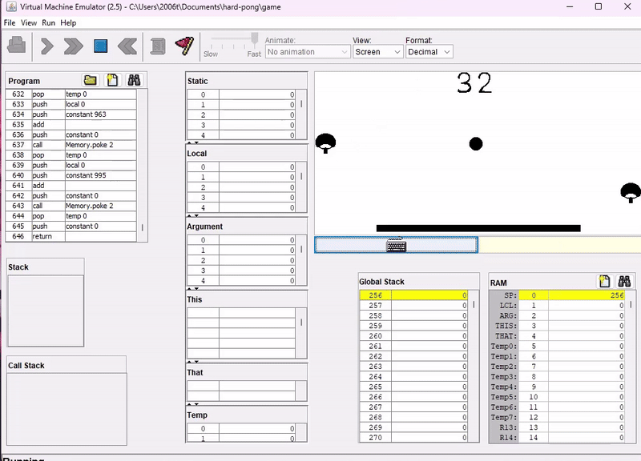
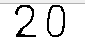
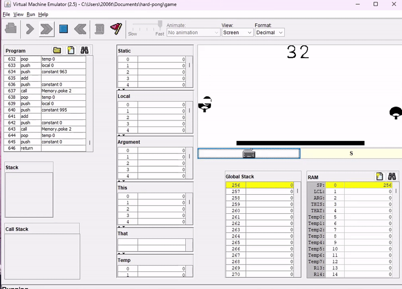
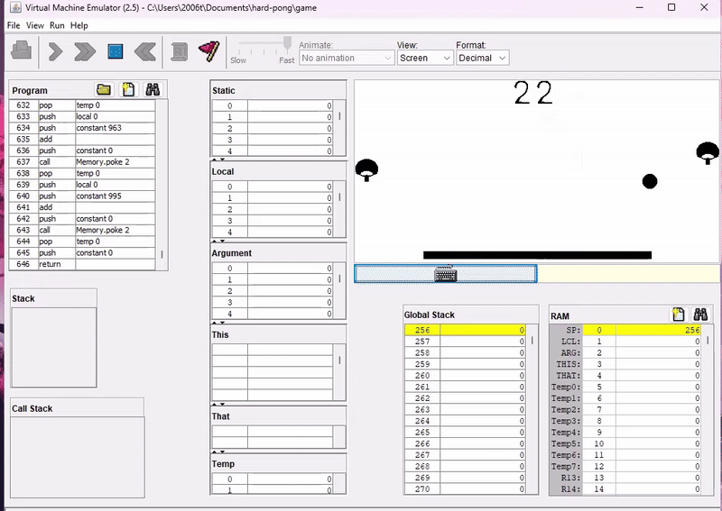

# Прикольчики:
- Прикольная идея, и реализации игры еще и на двоих человек
- Собственная отрисовка всего
- Приятно, что есть комменты в коде, так проще понимать где и что происходит
- В принципе код довольно хорошо разбит на классы и методы, и довольно просто читается, за исключением пары моментов, которые можно доработать
- 
# Не прикольчики:
- Как же их съедает(

- ну и мячик под цифрами прячется моментами

- Было бы прикольно иметь возможность начать сначала.
- А еще было бы круто видеть надпись о победе, после того, как все остальное с экрана будет очищено, как будто бы так логичнее.

- Ракетка может поймать мячик и увести его за границу и сломать все, а еще отрисовка цифер ломается

- Мячик может зажеваться, а потом тпхнуться

- Стоило бы сделать разделить, а то не соблюдается правило внутреннего и внешнего и кажется, что это один элемент

- Как-то мячик попадает в текстуры, но потом не отражается, а засчитывается как гол

# Предложения и микро замечания:
- Круто, что вы свои цифры отрисовываете. Но вопрос, насколько это менее оптимально, чем просто выводить интовские значения с помощью `do Output.PrintInt`, а еще, я не проверяла, но возможно тогда отрисовка бы не ломалась, но тут хз, просто подумала об этом
- Вы в мейне делаете `do game.dispose();`, при этом из инициализированных объектов у вас есть sphere, у которой тоже есть метод `dispose`, но его вы почему-то не используете.
- Возможно метод `doLogic` из класса `Sphere` можно было разбить на отдельные методы проверок столкновений, чтобы работа метода как-то соотносилась с названием

# Прикольчики:
- Можно словить положение, в котором можно ничего больше не нажимать и наслаждаться жизнью

