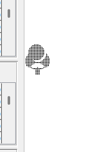
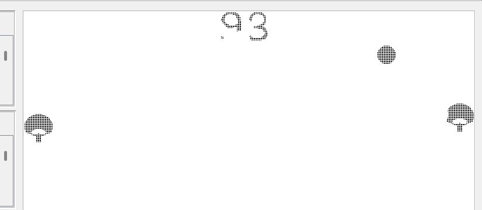
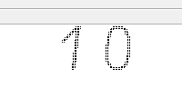
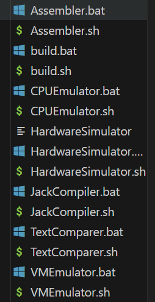

# Интерфейс и впечатления пользователя
## -вайбы 
   1. а кто ракетку кушает: 
 
2. вот в таком случае очко тоже засчитывается 
3. если мячик пролетает сквозь счет, то стирается какая-то часть циферок 

4. тут вот ошибка ```illigal radius``` вылезает
%20-%20D_nand%20to%20tetris_hard-pong_game%202025-03-30%2016-45-17%20(online-video-cutter.com).gif)
## +вайбы
1. отрисованные цифры и надписи: это выглядит просто шикарно, очень приятно играть, видя такую красоту, огромное уважение
2. в целом вся игра выглядит очень красиво 
3. не возникает нкикаких overflow(там вроде и негде), но это огрооомный плюс
## +- вайбы
1. не очень понятно, что это счет, возможно, стоит отделить двоеточием (очень сильно похоже на то, что это общий счет от 0 до 100)

    
## приколы
1. это лайтовая версия игры ?))
%20-%20D_nand%20to%20tetris_hard-pong_game%202025-03-30%2016-27-10%20(online-video-cutter.com).gif)
# Структура кода
## +вайбы
1. очень клево, что отрисовка каждой циферки в своей функции
2. комментарии в коде 
## -вайбы
1. ```doLogic()``` - не очень говорящее название, можно было вынести проверки коллизий в отдельные методы, а то получается одна не очень логичная куча проверок 
2. звучит немного странно, что мы делаем все проверки, от которых зависит вся игра в классе ```Sphere```, как будто эти проверки стоит вынести в класс игры или в отдельный класс проверок.
3. вы делаете ```game.dispose()```, но нигде не диспоузите sphere и score, хотя такие методы есть, поэтому, наверное, вы подразумевали, что это стоит сделать

### названия переменных
1. Sphere.jack
    ```c# 
    field int vx, vy;

    field int startX, startY;

    constructor Sphere new(int aX, int aY, int aSize, Racket aLeft, Racket aRight, Table aTable) {
        let x = aX;
        let y = aY;
        let startX = aX;
        let startY = aY;
        let size = aSize;
        let left = aLeft;
        let right = aRight;
        let table = aTable;
    ```
    не очевидно, что такое ```vx```, ```vy``` и приписка ```a``` у остальных переменных
# Общая архитектура
 1.можно было не закидывать это

  
# Предложения
1. хотелось бы иметь возможность, выбрать сложность, например, скорость мяча
2. при победе вылезает окошко:

а это страшно, можно вывести сначала текст о победе на весь экран, а потом завершать выполнение
3. хотелось бы кнопочку рестарта 

