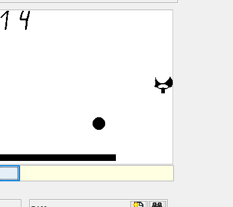
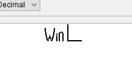
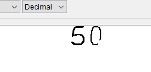
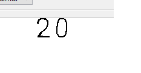
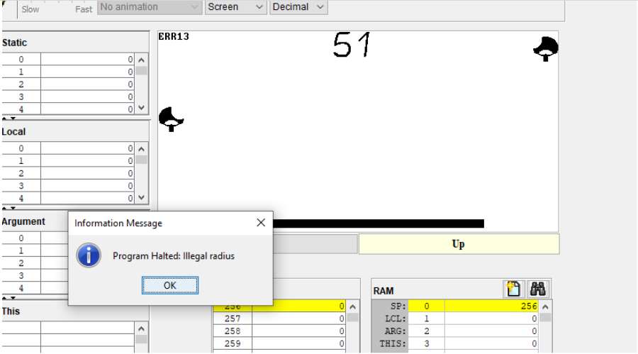

Плюсы:

1) Легко осваивается

2) Структурированный код

3) Комментарии в коде упрощают чтение кода

4) Понятные названия переменных и методов

5) Подробное описание проекта

Минусы:

1) Иногда стирается модель ракетки после столкновения с мячом

2) Наверное легче бы читалось, если бы в конце игры было написано
"Win Left Player" или "Win Right Player", а не просто "Win L", "Win R"

3) Иногда стираются цифры 

4) Наверное было бы лучше добавить разделитель между количеством очков каждого игрока.
А то выглядит, как будто бы написано "20", а не "2 : 0"

5) Хотелось бы, чтобы мячик реагировал на всю ракетку, а не только на какую-то ее часть

6) Иногда мячик застревает в ракетке и может выйти за пределы карты, что приводит к ошибке

7) NumberDrawing.jack

Может быть лучше просто выводить самые обычные символы цифр?
Они хоть так будут поменьше, но зато это будет производительнее, и для этого
не надо создавать огромный отдельный класс для отрисовки цифр

8) Score.jack

int LorR - давайте придумаем более подходящее название, и в camelCase, а не в UpperCase

if (leftNum > 9){
    do erase();
    do WinnerDrawing.drawLeft(location);
}
else{
    do erase();
    do WinnerDrawing.drawRight(location);
}
- думаю можно вынести erase из if и else

9) Sphere.jack

field int vx, vy; - не совсем понятные названия
